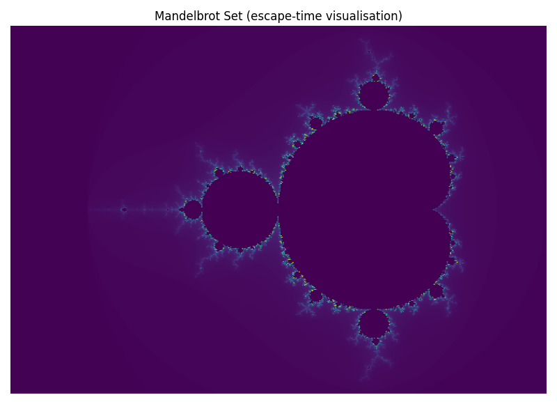

# Mandelbrot Set: Fractal Geometry and Complex Dynamics

This report explores the Mandelbrot set as a canonical fractal arising from iterative complex mappings, linking mathematical foundations with practical visualisation and insights from chaos and complex dynamics. It translates core ideas into accessible computation and imagery.

## External Links
[Read on Academia.edu – Exploring the Mandelbrot Set Mathematics and Visualisation](https://www.academia.edu/143427737/Exploring_the_Mandelbrot_Set_Mathematics_and_Visualisation?source=swp_share)

## Contents
- `Exploring_the_Mandelbrot_Set_Mathematics_and_Visualisation.pdf` – Full report  
- `example_mandelbrot.py` – Example Code
- `mandelbrot.png` – Example output produced by the script

## 📝 Abstract
This analysis covers:
- **Iterative complex mappings** – How repeated iteration generates the Mandelbrot boundary and rich internal structure.  
- **Escape-time visualisation** – Using iteration counts to render the fractal’s exterior layers.  
- **Boundary complexity** – Self-similarity, infinite detail, and connections to Julia sets and dynamical stability.  
- **Computation** – Practical approaches for rendering, parameter choices (viewport, iterations), and colour mapping.

## Example Code
Simple Python script to generate and save an image of the set.

The work bridges theory and computation, providing a compact reference for readers to **both understand and reproduce** visualisations of the Mandelbrot set.
