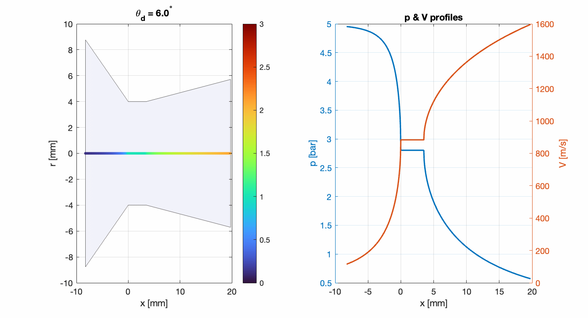

# Rocket Nozzle Contour Design and Fabrication

This project documents the **design, CAD modelling, and fabrication** of a rocket nozzle with defined contour angles (converging and diverging) using **aluminium 6061**.  
The nozzle was originally intended for use in research on:
- **Metal oxide additives in solid propellant combustion**  
- **Mathematical modelling of propulsion performance (Changed to LQR inverted pendulum)**

However, the variable of nozzle geometry was later **discarded** from both research projects in order to maintain focus on the effect of **metal oxides alone** (chemistry project) and to avoid overlap with the **mathematics project**.  

The manufactured nozzle was still utilised in combustion tests, but with **constant converging and diverging angles** across all experiments.

## Media and Photo Portfolio
[Google Drive Media Project Folder](https://drive.google.com/drive/folders/18ipQmDezKse8z_DnUNSBrUwpFgY4Biya?usp=drive_link)

## Contents
- `nozzle_sim.m` – Nozzle angle simulation prototype code
- `Nozzle_schematic` - CAD Drawing draft for manufacturing

## Notes
- Physical Nozzle Material: **Aluminium 6061** (machined via lathe and milling).  
- Geometry: Variable converging and diverging contour angle.  
- Status: **Supporting hardware** – design exploration not pursued further as a variable.  

## Context
- Related to:  
  - *Effect of Metal Oxide Enthalpy of Formation on Rocket Candy Energy Release*  
  - *Mathematical Modelling of Propulsion Systems (discarded scope)*  

## Code
Prototype script to vary diverging and converging angles

This folder serves as an archive of the nozzle design work, preserved for reference.
